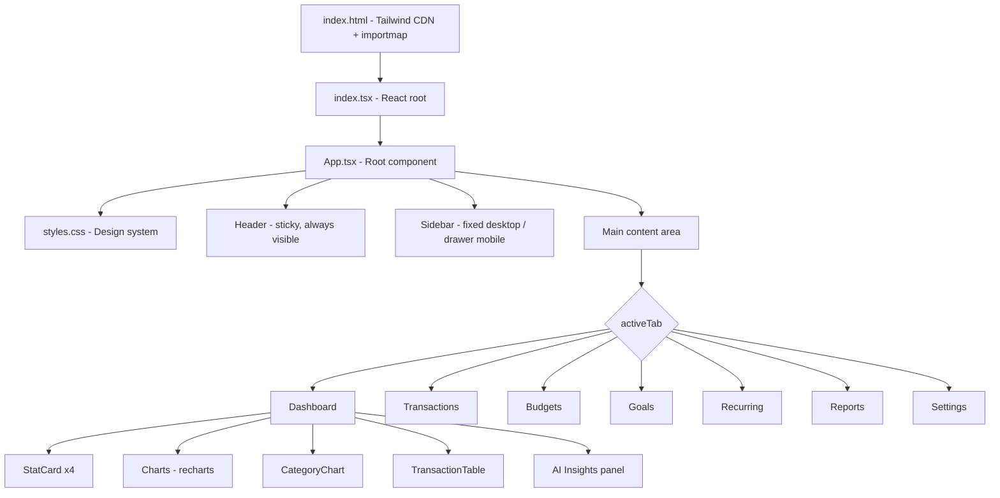

# Design Document: Professional UI Overhaul

## Overview

This overhaul consolidates the fragmented UPI Expense Intelligence codebase — six App variants and four CSS files — into a single canonical `App.tsx` and a unified `styles.css` design system. The result is a professional, production-grade finance tracking application with a sidebar navigation layout, consistent component styling, responsive design, and accessible color usage.

The primary technical goals are:
- Replace all CSS files with a single `styles.css` built on CSS custom properties (design tokens)
- Replace all App variants with a single `App.tsx` implementing full sidebar navigation
- Apply consistent `.card`, `.btn-primary`, `.btn-secondary`, `.input`, `.badge` classes across all 10 components
- Ensure responsive behavior from 320px mobile to 1440px+ desktop

The existing component logic (data processing, state management, Gemini AI integration, localStorage persistence) is preserved. Only the visual layer and layout structure change.

---

## Architecture

The application follows a single-page React architecture with client-side routing via tab state. There is no router library — `activeTab` state in `App.tsx` controls which component renders in the main content area.



### Key Architectural Decisions

**Single CSS file over CSS-in-JS or Tailwind-only**: The existing codebase uses Tailwind CDN for utility classes. The design system adds a `styles.css` layer of CSS custom properties and component classes that Tailwind utilities can reference or override. This avoids a full Tailwind config rewrite while providing a token-based system.

**Tab state over router**: The app is a single-page tool with no deep-linking requirements. `useState<ActiveTab>` in `App.tsx` is sufficient and avoids adding a router dependency.

**Component styling via CSS classes, not inline styles**: All components will use `.card`, `.btn-primary`, `.input`, etc. from `styles.css`. Inline `style={{}}` overrides are removed except for dynamic values (e.g., progress bar widths, category badge colors from `CATEGORY_COLORS`).

---

## Components and Interfaces

### App.tsx (rewritten)

The canonical root component. Replaces all six App variants.

```typescript
type ActiveTab = 'dashboard' | 'transactions' | 'budgets' | 'goals' | 'recurring' | 'reports' | 'settings';

interface AppState {
  activeTab: ActiveTab;
  transactions: Transaction[];
  budgets: Budget[];
  goals: Goal[];
  recurringTransactions: RecurringTransaction[];
  insights: SpendingInsight[];
  isImporting: boolean;
  isGeneratingAdvice: boolean;
  showImportModal: boolean;
  showTransactionModal: boolean;
  editingTransaction: Transaction | null;
  sidebarOpen: boolean; // mobile drawer state
}
```

Responsibilities:
- Renders sticky `<header>` with logo, app name, hamburger (mobile), and "Add Transaction" button
- Renders `<Sidebar>` as fixed panel (≥1024px) or off-canvas drawer (<1024px)
- Renders `<main>` content area switching on `activeTab`
- Manages all top-level state and localStorage persistence
- Passes handlers down to child components

### Sidebar (inline in App.tsx)

Navigation items: Dashboard, Transactions, Budgets, Goals, Recurring, Reports, Settings.

```typescript
interface NavItem {
  id: ActiveTab;
  label: string;
  icon: React.ReactNode; // SVG icon
}
```

On desktop (≥1024px): fixed left panel, always visible, `w-64`.
On mobile (<1024px): off-canvas drawer, `translate-x-full` when closed, `translate-x-0` when open. Semi-transparent backdrop overlay rendered when open.

### StatCard (new inline component in App.tsx)

```typescript
interface StatCardProps {
  label: string;
  value: string;
  icon?: React.ReactNode;
  accent?: 'primary' | 'success' | 'danger' | 'neutral';
  trend?: string; // e.g. "+12.5% from last month"
}
```

Uses `.card` base class. Accent variants apply a left border color via `.card--accent-primary`, `.card--accent-success`, `.card--accent-danger`.

### Card component (components/Card.tsx)

Unchanged interface. Updated to use `.card` CSS class instead of inline Tailwind classes.

```typescript
interface CardProps {
  children: React.ReactNode;
  title?: string;
  subtitle?: string;
  className?: string;
}
```

### TransactionTable (components/TransactionTable.tsx)

Read-only table. Updated to use design system row hover and badge styles. No interface changes.

### TransactionTableAdvanced (components/TransactionTableAdvanced.tsx)

Filter inputs updated to use `.input` class. Action buttons updated to `.btn-primary` / `.btn-secondary`. No interface changes.

### BudgetManager (components/BudgetManager.tsx)

Progress bars use semantic color tokens. Form inputs use `.input`. Buttons use `.btn-primary` / `.btn-secondary`. No interface changes.

### GoalTracker (components/GoalTracker.tsx)

Progress bars and status badges use semantic color tokens. Form inputs use `.input`. No interface changes.

### RecurringTransactionManager (components/RecurringTransactionManager.tsx)

Form inputs use `.input`. Buttons use `.btn-primary` / `.btn-secondary`. No interface changes.

### ReportGenerator (components/ReportGenerator.tsx)

Form inputs use `.input`. Buttons use `.btn-primary` / `.btn-secondary`. No interface changes.

### DataExportImport (components/DataExportImport.tsx)

Form inputs use `.input`. Buttons use `.btn-primary` / `.btn-secondary`. No interface changes.

### TransactionEditModal (components/TransactionEditModal.tsx)

Uses design system modal overlay (`.modal-overlay`), panel (`.modal-panel`), and form input (`.input`) styles. No interface changes.

---

## Data Models

No new data models are introduced. The overhaul is purely a visual/layout change. Existing models remain:

```typescript
// types.ts - unchanged
interface Transaction { id, date, description, amount, category, type }
interface Budget { category, limit }
interface SpendingInsight { title, description, suggestion, impact }
interface DashboardStats { totalBalance, monthlyExpenses, monthlyIncome, topCategory }

// types-extended.ts - unchanged
interface RecurringTransaction { ... }
interface Goal { ... }
interface BudgetAdvanced extends Budget { ... }
interface Report { ... }
interface Notification { ... }
```

### Design Token Model (styles.css)

The CSS custom properties constitute the design system's data model:

```css
:root {
  /* Color tokens */
  --color-bg: #ffffff;
  --color-surface: #f8fafc;
  --color-surface-raised: #ffffff;
  --color-border: #e2e8f0;
  --color-border-subtle: #f1f5f9;

  --color-text-primary: #0f172a;
  --color-text-secondary: #475569;
  --color-text-muted: #94a3b8;

  --color-primary: #4f46e5;        /* indigo-600 */
  --color-primary-hover: #4338ca;  /* indigo-700 */
  --color-primary-light: #eef2ff;  /* indigo-50 */
  --color-primary-text: #ffffff;

  --color-success: #16a34a;        /* green-600 */
  --color-success-light: #f0fdf4;  /* green-50 */
  --color-success-border: #bbf7d0; /* green-200 */

  --color-warning: #d97706;        /* amber-600 */
  --color-warning-light: #fffbeb;  /* amber-50 */
  --color-warning-border: #fde68a; /* amber-200 */

  --color-danger: #dc2626;         /* red-600 */
  --color-danger-light: #fef2f2;   /* red-50 */
  --color-danger-border: #fecaca;  /* red-200 */

  /* Spacing */
  --space-1: 0.25rem;
  --space-2: 0.5rem;
  --space-3: 0.75rem;
  --space-4: 1rem;
  --space-6: 1.5rem;
  --space-8: 2rem;

  /* Typography */
  --font-sans: -apple-system, BlinkMacSystemFont, 'Segoe UI', 'Inter', sans-serif;
  --text-xs: 0.75rem;
  --text-sm: 0.875rem;
  --text-base: 1rem;
  --text-lg: 1.125rem;
  --text-xl: 1.25rem;
  --text-2xl: 1.5rem;

  /* Shadows */
  --shadow-sm: 0 1px 2px 0 rgb(0 0 0 / 0.05);
  --shadow-md: 0 4px 6px -1px rgb(0 0 0 / 0.1), 0 2px 4px -2px rgb(0 0 0 / 0.1);
  --shadow-lg: 0 10px 15px -3px rgb(0 0 0 / 0.1), 0 4px 6px -4px rgb(0 0 0 / 0.1);

  /* Border radius */
  --radius-sm: 0.375rem;
  --radius-md: 0.5rem;
  --radius-lg: 0.75rem;
  --radius-xl: 1rem;
  --radius-2xl: 1.5rem;

  /* Transitions */
  --transition-fast: 150ms cubic-bezier(0.4, 0, 0.2, 1);
  --transition-base: 200ms cubic-bezier(0.4, 0, 0.2, 1);
}
```

### Component CSS Classes

```css
/* Surface */
.card { background: var(--color-surface-raised); border: 1px solid var(--color-border); border-radius: var(--radius-xl); box-shadow: var(--shadow-sm); padding: var(--space-6); }
.card--accent-primary { border-left: 4px solid var(--color-primary); }
.card--accent-success  { border-left: 4px solid var(--color-success); }
.card--accent-danger   { border-left: 4px solid var(--color-danger); }

/* Buttons */
.btn-primary   { background: var(--color-primary); color: var(--color-primary-text); border-radius: var(--radius-lg); padding: var(--space-2) var(--space-4); font-weight: 600; min-height: 44px; min-width: 44px; }
.btn-secondary { background: transparent; color: var(--color-text-secondary); border: 1px solid var(--color-border); border-radius: var(--radius-lg); padding: var(--space-2) var(--space-4); font-weight: 500; min-height: 44px; min-width: 44px; }

/* Inputs */
.input { border: 1px solid var(--color-border); border-radius: var(--radius-md); padding: var(--space-2) var(--space-3); font-size: var(--text-sm); background: var(--color-surface-raised); color: var(--color-text-primary); width: 100%; }
.input:focus { outline: none; border-color: var(--color-primary); box-shadow: 0 0 0 3px rgb(79 70 229 / 0.1); }

/* Badges */
.badge         { display: inline-flex; align-items: center; padding: 0.125rem var(--space-2); border-radius: 9999px; font-size: var(--text-xs); font-weight: 500; }
.badge--success { background: var(--color-success-light); color: var(--color-success); }
.badge--warning { background: var(--color-warning-light); color: var(--color-warning); }
.badge--danger  { background: var(--color-danger-light); color: var(--color-danger); }
.badge--neutral { background: var(--color-surface); color: var(--color-text-secondary); }

/* Sidebar */
.sidebar { background: var(--color-surface-raised); border-right: 1px solid var(--color-border); width: 16rem; height: 100vh; display: flex; flex-direction: column; }
.sidebar-item { display: flex; align-items: center; gap: var(--space-3); padding: var(--space-3) var(--space-4); border-radius: var(--radius-lg); color: var(--color-text-secondary); font-weight: 500; font-size: var(--text-sm); min-height: 44px; transition: background var(--transition-fast), color var(--transition-fast); }
.sidebar-item:hover  { background: var(--color-surface); color: var(--color-text-primary); }
.sidebar-item.active { background: var(--color-primary-light); color: var(--color-primary); font-weight: 600; }

/* Modal */
.modal-overlay { position: fixed; inset: 0; background: rgb(15 23 42 / 0.6); backdrop-filter: blur(4px); z-index: 50; display: flex; align-items: center; justify-content: center; padding: var(--space-4); }
.modal-panel   { background: var(--color-surface-raised); border-radius: var(--radius-2xl); box-shadow: var(--shadow-lg); width: 100%; max-width: 28rem; overflow: hidden; }
```

---

## Correctness Properties

*A property is a characteristic or behavior that should hold true across all valid executions of a system — essentially, a formal statement about what the system should do. Properties serve as the bridge between human-readable specifications and machine-verifiable correctness guarantees.*

### Property 1: localStorage round-trip for transactions

*For any* array of transactions written to `localStorage` under `upi_transactions`, reading and JSON-parsing that key should produce an array equal to the original.

**Validates: Requirements 10.2**

---

### Property 2: localStorage round-trip for budgets

*For any* array of budgets written to `localStorage` under `upi_budgets`, reading and JSON-parsing that key should produce an array equal to the original.

**Validates: Requirements 10.3**

---

### Property 3: localStorage round-trip for goals

*For any* array of goals written to `localStorage` under `upi_goals`, reading and JSON-parsing that key should produce an array equal to the original.

**Validates: Requirements 10.4**

---

### Property 4: localStorage round-trip for recurring transactions

*For any* array of recurring transactions written to `localStorage` under `upi_recurring`, reading and JSON-parsing that key should produce an array equal to the original.

**Validates: Requirements 10.5**

---

### Property 5: Budget alert threshold invariant

*For any* budget and its corresponding spending total, the alert type should be `'critical'` if and only if `percent >= 100`, and `'warning'` if and only if `80 <= percent < 100`, and no alert if `percent < 80`.

**Validates: Requirements 3.6, 8.5**

---

### Property 6: StatCard Indian locale formatting

*For any* numeric amount, the formatted string produced by the StatCard should start with `₹` and use the `en-IN` locale (i.e., commas at Indian grouping positions).

**Validates: Requirements 4.1**

---

### Property 7: Transaction deletion removes from state

*For any* transaction list and any transaction ID in that list, deleting by that ID should produce a list that does not contain the transaction with that ID, and all other transactions remain unchanged.

**Validates: Requirements 9.5**

---

### Property 8: SAMPLE_TRANSACTIONS fallback

*For any* app mount where `localStorage` does not contain `upi_transactions`, the initial transactions state should equal `SAMPLE_TRANSACTIONS`.

**Validates: Requirements 10.6**

---

### Property 9: Budget progress bar color invariant

*For any* budget with a computed `percent` value, the progress bar CSS class should be `bg-green-500` when `percent < 80`, `bg-amber-500` when `80 <= percent < 100`, and `bg-red-500` when `percent >= 100`.

**Validates: Requirements 5.4, 8.5**

---

## Error Handling

### Import / File Processing Errors

- File size > 10MB: alert with descriptive message, abort processing
- Unsupported file type: alert with supported types listed, abort processing
- `categorizeTransactions` returns empty array: alert user, do not update state
- `categorizeTransactions` throws: catch, extract `error.message`, alert user
- `FileReader` error: alert user to retry

### localStorage Errors

- `JSON.parse` failure on mount: catch silently, fall back to `SAMPLE_TRANSACTIONS` / empty arrays
- `localStorage.setItem` quota exceeded: catch silently, log to console (data is still in memory)

### Form Validation Errors

All forms (TransactionEditModal, BudgetForm, GoalForm, RecurringTransactionForm) validate required fields before submission and display inline error messages. Submission is blocked until validation passes.

### Gemini AI Errors

- `getFinancialAdvice` throws: catch, alert with message, do not update insights state
- Empty insights array returned: alert user, do not update state

---

## Testing Strategy

### Unit Tests

Unit tests cover specific examples, edge cases, and pure functions:

- `formatCurrency(amount)` — verify `₹` prefix and `en-IN` locale for known values (0, 1000, 100000, 10000000)
- `getBudgetAlertType(percent)` — verify correct alert type for boundary values: 0, 79, 80, 99, 100, 101
- `getBudgetProgressClass(percent)` — verify correct CSS class for boundary values
- `parseCSV(text)` — verify correct parsing for valid CSV, missing headers, empty rows
- `parseJSON(text)` — verify correct parsing for array format and `{transactions:[]}` format
- Transaction deletion handler — verify the correct transaction is removed and others remain

### Property-Based Tests

Property tests use a property-based testing library (e.g., `fast-check` for TypeScript) and run a minimum of 100 iterations each.

Each test is tagged with a comment referencing the design property it validates.

**Feature: professional-ui-overhaul**

- **Property 1** — `Feature: professional-ui-overhaul, Property 1: localStorage round-trip for transactions`
  Generate random arrays of `Transaction` objects, serialize to JSON, store in a mock localStorage, read back and parse, assert deep equality.

- **Property 2** — `Feature: professional-ui-overhaul, Property 2: localStorage round-trip for budgets`
  Generate random arrays of `Budget` objects, serialize, store, read back, assert deep equality.

- **Property 3** — `Feature: professional-ui-overhaul, Property 3: localStorage round-trip for goals`
  Generate random arrays of `Goal` objects, serialize, store, read back, assert deep equality.

- **Property 4** — `Feature: professional-ui-overhaul, Property 4: localStorage round-trip for recurring transactions`
  Generate random arrays of `RecurringTransaction` objects, serialize, store, read back, assert deep equality.

- **Property 5** — `Feature: professional-ui-overhaul, Property 5: Budget alert threshold invariant`
  Generate random `percent` values (0–150), compute alert type, assert the correct threshold mapping holds for all inputs.

- **Property 6** — `Feature: professional-ui-overhaul, Property 6: StatCard Indian locale formatting`
  Generate random non-negative integers, format with the StatCard formatter, assert the result starts with `₹` and matches `en-IN` locale output.

- **Property 7** — `Feature: professional-ui-overhaul, Property 7: Transaction deletion removes from state`
  Generate random transaction arrays (length ≥ 1), pick a random ID, apply the delete handler, assert the ID is absent and all other transactions are present.

- **Property 8** — `Feature: professional-ui-overhaul, Property 8: SAMPLE_TRANSACTIONS fallback`
  Simulate mount with empty localStorage, assert initial state equals `SAMPLE_TRANSACTIONS`.

- **Property 9** — `Feature: professional-ui-overhaul, Property 9: Budget progress bar color invariant`
  Generate random `percent` values, apply the progress bar class selector, assert the correct class for each threshold range.

**Configuration**: Each property test runs a minimum of 100 iterations. The `fast-check` library is recommended (`npm install --save-dev fast-check`).
